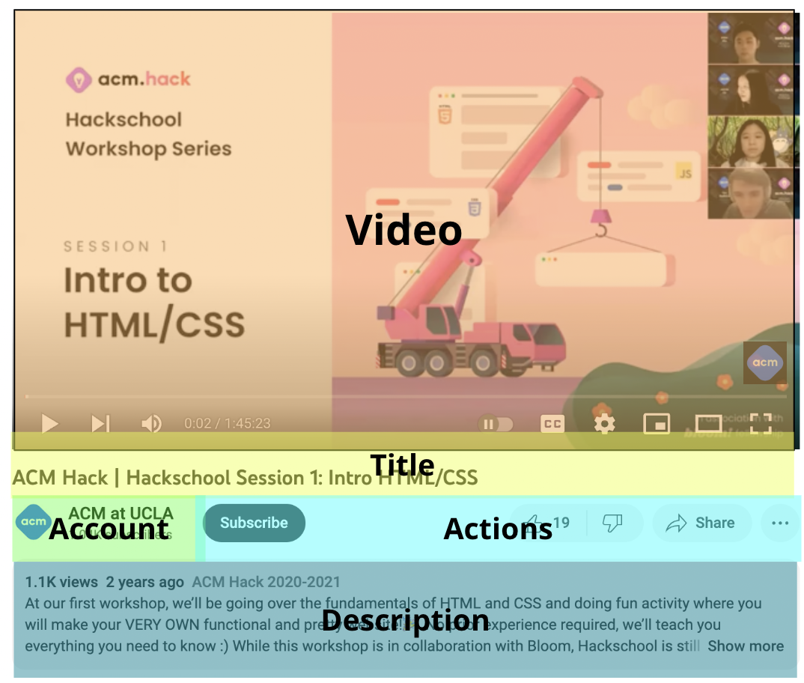
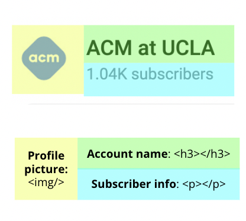
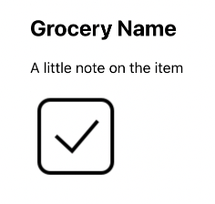

# HOTH X - Intro to React
**Teacher**: Brooke jiang

Hi! Weicome to the Intro to React workshop. If you're not yet familiar with HTML/CSS/Javascript, make sure you watch those relevant workshops first!

## Introducing React
### What is React?
- Free, open-source JavaScript library for frontend development
- Maintained by Meta and an open-source community
- Widely used, including by some of the biggest companies you know: Netflix, Instagram, Uber...


### Why React?
~~flex~~
- Reusable components: the components-based structure of React lets you start with tiny components like buttons, checkboxes, etc. and wrap in higher-level components until creating the entire app – and display different information using the same components!
- Efficient updates: This means you can update individual components instead of reloading entire page!
- Flexibility: Once you learn React, you can use it for static sites with[Gatsby](https://www.gatsbyjs.com/), make mobile apps with React Native, even build Desktop applications with tools like [Electron](https://www.electronjs.org/)!
- High-demand skill in industry

## Getting Started
### Downloads
Make sure you have a text editor (such as Visual Studio Code) and a web browser (such as Chrome) handy!
In addition, make sure you have downloaded Node.js: [Node.js download](https://nodejs.org/en/) – This allows for a development server where we can see the effect of our code in real time!
(Get the LTS, 64-bit version!)

### Setting up a react project
Just open Terminal (Mac) / Powershell (Windows) and run these three easy lines
```
npx create-react-app <your-app-name>
cd <your-app-name>
npm start
```

### Using React: JSX
extension of javascript, lets you write html-style code in your javascript file
`const elem = <h1> Brooke is my favorite Hack officer </h1>`

#### Why JSX?
- Lets us create react elements that we will render later
- Allows us to evaluate Javascript expressions, surrrounded by curly braces

#### JSX Syntax
Curly braces allow you to put javascript variables inside of your JSX!

For example:
```javascript
const name = 'Brooke';
const elem = <h1> {name} is my favorite Hack officer </h1>;
```
Gives us same as previous code

Another example: 

```javascript
const elem = <h1> 1+2 = {1+2} </h1>;
```
Gives us: 1+2=3

This works with functions as well!
```javascript
const nameFunction = () => {
   return 'Hack';
};
const elem = <h1>I love {nameFunction()}!</h1>;
```

## Components
### What is a React Component?
- Key to react: Components are how we can reuse code! Think building blocks of a webpage
- Components accept inputs as “props”, and returns a react element
### Example: a Youtube page, broken down into React components


And, if we zoom in on a particular component such as the account component, we'll see that that itself is made up of smaller components!

###Functional components
Out of the two kinds of React components, functional and class components, we will be working with the former today.
Functional components are essentially just javascript functions that accepts props as an argument and returns a React element. For example:
```javascript
function Grocery() {
  return(
      <div>
          <h2>Grocery Name</h2>
          <p>A little note on the item</p>
          
      </div>
  );
}

```
This gives us the following (unstyled) component


### import & export
Usually, we want to keep each component in its own separate file. So how do we use the component elsewhere in our code?
It's crucial not to forget to **import and export** your components!
In the component file, put:
```javascript
export default Grocery;
```
In the file where you want to use the component, put
```javascript
import Grocery from "<directory>/Grocery.js";
```

## Props
### What is a prop?
- Props allow us to display different things in every grocery component!
Here is what an example prop might look like:
```javascript
props:   {
 name: ‘Grocery Name’,
 notes: ‘A little note on the item’
}
```
### Using props
- Remember how functions take inputs? A prop is out input to the function component
- Props are passed into the functional component as a JavaScript object

Here is what it will look like inside App.js: 
```javascript
function Grocery(props){
    //code for this component
}
<Grocery name="cereal" notes="puffins brand"/>
<Grocery name="apples" notes="about 10 total"/>
```
Now, inside of Grocery.js, instead of having the information hardcoded each time like this

```javascript
function Grocery(){
    return (
        <div>
            <h3> name = "cereal" </h3>
            <p> notes = "puffins brand" <p>
        </div>
    )
}
```

We can instead access properties of props that correspond to our self-defined attribute

```javascript
function Grocery(props){
    return (
        <div>
            <h3> {props.name}" </h3>
            <p> {props.notes} <p>
        </div>
    )
}
```


## array.map()
### What is array.map()?
Recall that **arrays** are collections of items of the same type, such as `[ 1, 2, 3, 4 ]` or `[ “this”, “is”, “an”, “array” ]`

The .map() function in JavaScript lets us run a for loop that
1. Takes each item in the array
2. Performs an operation on it
3. Put the resulting item in a new array that’s returned at end

Think of it in terms of this picture of fruit: .map() takes in the array of fruit, takes the first item (the apple), runs the operation we want it to (slicing), puts it in new array, takes the second item (the orange), runs the operation we want it to (slicing), puts it in new array...and finally returns the newly-made array of sliced fruit.
 [slicing fruit](./images/slicing-fruit.png)

As an actual example: if I created an array `odds = [1,2,3,4,5]` and called the map function with 
```javascript
evens = odds.map(x => x*2)
```
the map function would run `x*2` on every element x of the array arr, and return the resulting array so that `evens` is set to `[2,4,6,8,10]`.

## State
### What is State?
- State lets us keep track of component properties that can change on screen
- Usually, change happens after clicking: Instagram like button, countdown display

### useState()
useState() is the function with which we, well, use state.

First, remember to import useState() in order to use it
```javascript
import React, { useState } from 'react';
```

`useState()`'s return values is an array of two elements: The first element contains state data, and the second element is a function that we can use to update state – note that we should never try to modify state directly – this will not re-render a component – only through the function `useState()` returns!

```javascript
const [ count, setCount ] = useState(0);
```

useState() also takes in a parameter, and this is the initial state we want to set to the State element

In the context of our demo, we want to able to check off whether a grocery item was purchased: if the image is clicked, we **invert the checkbox state** and **change the image displayed**. This is what our img tag should look like:

```
import uncheckedBox from '../images/unchecked-box.png'
import checkedBox from '../images/checked-box.png'

...

 setCheckboxStatus(!checkboxStatus)}/>
```

## Recap
**WHew !!!**
Congrats on having made it to the end of this workshop! By now, we have learned about:
1. React, JSX: React is a popular tool for frontend web development, JSX is a Javascript add-on that lets us write HTML in Javascript
2. Components: these are building blocks of React, helps us reuse code
3. Props & array.map(): these allow us to use the same component to display different information
4. State: This is data that is stored and updated by a component

## Happy Hacking!!